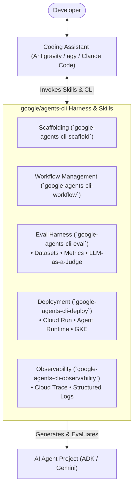

# Build Agents with Google Agent CLI

Notes, prerequisites, and takeaway logs for the online masterclass by **Thu Ya Kyaw** ([@iamthuya](https://luma.com/user/iamthuya)) hosted by **Beyond the Vibes Community**.

- **Event URL**: [Luma Event](https://luma.com/84fijlfq?tk=LE8bWb)
- **Google Meet**: [meet.google.com/ich-tupv-gyj](https://meet.google.com/ich-tupv-gyj)
- **Repository**: [github.com/google/agents-cli](https://github.com/google/agents-cli)
- **Date & Time**: Wednesday, September 16, 2026 · 7:00 PM – 8:00 PM (GMT+8)
- **Format**: Virtual / Online Session
- **Topic**: AI Agent Engineering

---

## 🎯 What is `google/agents-cli`?

> *"The CLI and skills that turn any coding assistant into an expert at creating, evaluating, and deploying AI agents on Google Cloud."*

`agents-cli` is **not** an alternative to Antigravity—it is a specialized **Agent Lifecycle Harness and Skill Suite** designed to work inside coding assistants like **Antigravity**, Claude Code, or Cursor.

### Architecture Relationship



---

## 🔑 Access & Environment Requirements

- **Do you need GCP access?**: **No**. Local development, project scaffolding, and evaluation runs do **not** require a Google Cloud billing account or project.
- **Is Antigravity strictly required?**: **No**. While Antigravity provides native skill integration, `agents-cli` also works standalone in your normal terminal, or with Claude Code, Codex, and Cursor.
- **Why `GEMINI_API_KEY` is needed**:
  - While Antigravity itself is logged into your Google account on desktop, the **target agent scripts** you build and test in the terminal run as independent Python processes.
  - Google ADK and `agents-cli eval` look for `GEMINI_API_KEY` (or Google Cloud Application Default Credentials `gcloud auth application-default login`) to send inference requests to Gemini.
  - You can grab a **free API key** in 30 seconds from [Google AI Studio](https://aistudio.google.com/app/api-keys) (no credit card required).
- **Can you use `agy-bridge`?**:
  - **Yes**, for text generation or OpenAI-compatible client libraries (`base_url="http://127.0.0.1:8000/v1"`), `agy-bridge` routes traffic through your authenticated local Antigravity CLI (`agy`) with zero API key.
  - **Caveat**: Native Google ADK projects default to `google-genai` and structured function-calling schemas, so having a free `GEMINI_API_KEY` ready avoids having to adapt starter code.
- **Google Cloud Deployment**: Only needed if you run `agents-cli deploy` to publish the agent live to Cloud Run or Vertex AI Agent Runtime. If you deploy elsewhere (AWS, Fly.io, VPS), ADK agents are standard containerizable Python apps.

---

## 💻 Cross-Platform Setup Guide (`google/agents-cli`)

The official toolchain relies on **`uv`** (Python package installer) and **Node.js** (for skill management).

### 🍎 1. macOS Setup

```bash
# 1. Install prerequisites via Homebrew (Git, Node.js, and uv)
brew install git node uv

# 2. Ensure Python 3.11+ is available (agents-cli requires Python 3.11+)
uv python install 3.11

# 3. Run google-agents-cli setup (installs CLI and prepares runtime)
uvx google-agents-cli setup

# 4. Inject agent skills into your coding assistant (Antigravity, Claude Code, Codex)
npx skills add google/agents-cli

# 5. Verify installation
agents-cli --help
```

#### Setting `GEMINI_API_KEY` on macOS:

- **If using PowerShell (`pwsh`):**
  ```powershell
  # Set for current session
  $env:GEMINI_API_KEY = "your-api-key-here"

  # Persist across sessions in your PowerShell Profile ($PROFILE)
  if (!(Test-Path -Path $PROFILE)) { New-Item -ItemType File -Path $PROFILE -Force }
  Add-Content -Path $PROFILE -Value '$env:GEMINI_API_KEY = "your-api-key-here"'
  ```
  *(Note: On macOS/Linux, `[System.Environment]::SetEnvironmentVariable(..., "User")` does not persist across terminal sessions; writing to `$PROFILE` is the proper mechanism).*

- **If using Zsh (default macOS shell):**
  ```bash
  # Set for current session and persist in ~/.zshrc
  export GEMINI_API_KEY="your-api-key-here"
  echo 'export GEMINI_API_KEY="your-api-key-here"' >> ~/.zshrc
  source ~/.zshrc
  ```

#### ✈️ Pre-Flight Verification / Smoke Test
Run this quick 60-second test to confirm your CLI, Python environment, and Gemini API key work end-to-end:

> [!TIP]
> **Google AI Studio vs. Vertex AI ADC Gotcha**: Newly scaffolded projects generate a `.env` defaulting to `GOOGLE_GENAI_USE_VERTEXAI=true` (which requires GCP Cloud credentials). When using a Google AI Studio `GEMINI_API_KEY`, ensure `GOOGLE_GENAI_USE_VERTEXAI=false` is exported or set in your project's `.env`.

**In PowerShell (`pwsh`):**
```powershell
# 1. Scaffold a test agent
agents-cli create smoke-agent --agent adk --auto-approve
Set-Location smoke-agent

# 2. Sync dependencies
agents-cli install

# 3. Test execution with your API key
agents-cli run "Reply with 'Agents CLI is ready!' if you can read this."

# 4. Clean up
Set-Location ..; Remove-Item -Recurse -Force smoke-agent
```

**In Bash / Zsh:**
```bash
# 1. Scaffold a test agent
agents-cli create smoke-agent --agent adk --auto-approve
cd smoke-agent

# 2. Sync dependencies
agents-cli install

# 3. Test execution with your API key
agents-cli run "Reply with 'Agents CLI is ready!' if you can read this."

# 4. Clean up
cd .. && rm -rf smoke-agent
```
*If you see `[smoke_agent]: Agents CLI is ready!` in your terminal, your MacBook is 100% verified and ready for the live workshop.*

---

### 🪟 2. Windows Setup

Open **PowerShell** (as standard user or Admin):

```powershell
# 1. Install prerequisites via winget
winget install --id Git.Git -e
winget install --id OpenJS.NodeJS -e

# 2. Install uv
powershell -ExecutionPolicy ByPass -c "irm https://astral.sh/uv/install.ps1 | iex"

# 3. Refresh environment path and run setup
$env:Path = [System.Environment]::GetEnvironmentVariable("Path","Machine") + ";" + [System.Environment]::GetEnvironmentVariable("Path","User")
uvx google-agents-cli setup

# 4. Verify installation
agents-cli --help

# 5. Set Gemini API Key (current session + permanent user environment)
$env:GEMINI_API_KEY="your-api-key-here"
[System.Environment]::SetEnvironmentVariable("GEMINI_API_KEY", "your-api-key-here", "User")
```

---

## 🧠 Key Skills Injected into Your Assistant

Once `agents-cli setup` is run, the following skills are made available to Antigravity and other agentic tools:

| Skill | Purpose |
| :--- | :--- |
| **`google-agents-cli-scaffold`** | Project creation and standards-compliant templates using Google ADK. |
| **`google-agents-cli-adk-code`** | ADK Python API patterns, tool definitions, orchestration, callbacks, and state. |
| **`google-agents-cli-workflow`** | Development lifecycle management, model selection, and code preservation. |
| **`google-agents-cli-eval`** | Automated evaluation harness: benchmark datasets, metrics, and LLM-as-a-judge. |
| **`google-agents-cli-deploy`** | Packaging and deploying agents to Cloud Run, Agent Runtime, or GKE. |
| **`google-agents-cli-publish`** | Agent Registry and Gemini Enterprise registration / fleet management. |
| **`google-agents-cli-observability`** | Wiring telemetry into Cloud Trace and Google Cloud Logging. |


---

## ⚡ Essential CLI Commands Cheat Sheet

| Command | Purpose |
| :--- | :--- |
| `agents-cli create <name>` | Scaffold a new agent project based on Google ADK. |
| `agents-cli run "prompt"` | Run an agent prompt locally through the terminal. |
| `agents-cli scaffold enhance` | Add deployment & CI/CD configs to an existing agent codebase. |
| `agents-cli eval run` | Run evaluation suites against test datasets locally. |
| `agents-cli eval grade` | Grade agent responses using LLM-as-a-judge rubrics. |
| `agents-cli eval dataset synthesize` | Automatically generate synthetic evaluation test cases. |
| `agents-cli eval compare` | Compare performance across model, prompt, or tool variants. |
| `agents-cli eval optimize` | Automatically tune prompts/tools against evaluation metrics. |
| `agents-cli deploy` | Deploy agent to GCP (Cloud Run, GKE, Agent Runtime) if using GCP. |

---

## ❓ Questions for Q&A

- [ ] *How does `agents-cli-eval` handle local mock tools versus live API evaluation runs?*
- [ ] *Can `agents-cli` and ADK projects be configured with custom OpenAI-compatible proxy endpoints (e.g. `base_url` or LiteLLM) or local models?*
- [ ] *What is the recommended boundary between local testing with Gemini API keys vs. Vertex AI Agent Runtime?*
- [ ] *Can custom rubric judges be plugged into `agents-cli-eval` for domain-specific agent verification?*
- [ ] *How does `agents-cli` manage state persistence and checkpoints when deploying to Cloud Run?*

---

## ✍️ Live Session Notes & Takeaways

*(Use this section during the session to capture key insights, code snippets, and terminal tricks)*

### Introduction & Foundations
- 

### CLI Tips, Shortcuts & Scaffolding
- 

### Evaluation Harness & LLM-as-a-Judge
- 

### Antigravity Integration Demos
- 

### Action Items & Experiments to Try
- [x] Run `uvx google-agents-cli setup` on the local machine.
- [x] Grab a free Gemini API key from Google AI Studio and export `GEMINI_API_KEY` (persisted in `~/.env`).
- [x] Run pre-flight smoke test to verify local agent execution and inference.
- [ ] Prompt Antigravity to scaffold a test agent using the injected skills.
- [ ] Run a local evaluation suite with `agents-cli eval`.
- [ ] (Optional experiment) Test routing non-tool agent runs or eval prompts through `agy-bridge` (`http://127.0.0.1:8000/v1`).
