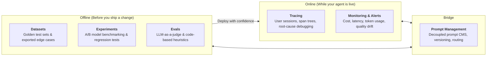
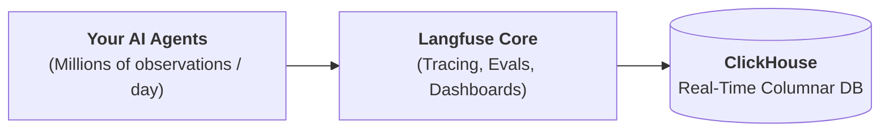

# Shipping Reliable AI Agents · Building with Langfuse and ClickHouse

> **Speaker**: **Max Deichmann** (Co-Founder & CTO, Langfuse)  
> **Event**: ClickHouse Singapore Meetup · Special Edition on Building AI Products  
> **Date & Time**: Friday, September 25, 2026 · 7:00 PM – 9:00 PM SGT  
> **Venue**: AWS Office, Singapore  
> **Event URL**: [Luma Event](https://luma.com/clickh-wxuk?tk=UDQDhF)  
> **Companion Talk**: [[Trace It, Store It, Ship It - LLM Observability at GovTech SG]] (Joel Foo, GovTech SG)  
> **Visual Infographic**: [[langfuse-clickhouse-infographic.html|Interactive Meetup Infographic]] (`Attachments/langfuse-clickhouse-infographic.html`)  
> **Related Notes**: [[The Road Under the Harness (Ng Shangru)]] • [[AI Agent Engineering]] • [[TypeSafe AI Jev - System One Decision Models]] • [[Building AI Agents for Business and Beyond]] • [[Communication Is Key - Agent Protocols (MCP & A2A)]] • [[GDG Monthly Meetup 2609 - Local AI Agent Workshop with Hermes & Google MCP]]

---

## 📸 Opening Slide & Speaker

![[clickhouse-langfuse-max-deichmann.jpg]]

---

## 🎯 Executive Overview & Core Problem

Building with LLMs is straightforward during prototyping; running them reliably, observably, and economically in production at enterprise scale is the hard part.

```
"You cannot see this from the input and output. You have to see the path."
— Max Deichmann
```

### Key Themes
- **The Observability Gap**: Why traditional infrastructure APM (HTTP `200 OK`, latency graphs, CPU/RAM metrics) fails completely to catch semantic agent failures.
- **Trace-Level Observability**: Deconstructing the agentic execution path across prompts, model calls, vector retrieval chunks, and tool invocations.
- **Why ClickHouse**: AI agents generate 10x–100x more telemetry volume than human user workflows. ClickHouse provides the columnar architecture, 14x compression, and sub-second analytical querying needed to store 100% of telemetry without sampling.
- **The Closed Development Loop**: Unifying online monitoring (tracing, alerts, session replays) with offline engineering (evals, datasets, prompt management, regression testing in CI/CD).

---

## 🔍 The Observability Gap: Confidently Wrong Support Agents

![[clickhouse-langfuse-observability-gap.jpg]]

### Case Study: Support Agent Hallucination
- **User Scenario**: A customer asks for a refund after cancelling a Pro subscription on Day 17.
- **Agent Response**: Confidently approves a pro-rated refund, citing an alleged "30-day money-back guarantee window."
- **Actual Enterprise Policy**: Pro subscriptions are strictly non-refundable after Day 14.

### The Core Problem ("The Observability Gap")
- Traditional APM metrics reported green across the board:
  - HTTP `200 OK` status code.
  - Normal response latency (~1.4s).
  - Zero runtime exceptions or application crashes.
- **Takeaway**: Classical APM monitoring cannot detect semantic errors, regulatory violations, or business logic hallucinations when an agent is **confidently wrong**.
- **Observability Requirement**: Deep trace-level inspection (recording prompts, retrieval chunks, intermediate tool parameters, and model outputs) paired with semantic evaluation rules to catch silent failures before they cause customer or financial harm.

---

## 🔬 Trace-Level Observability: The Failure Hides Inside the Path

![[clickhouse-langfuse-trace-level-observability.jpg]]

### Execution Trace Breakdown (`support-agent.handle` — 1,412 ms total)
1. `classify-intent` (LLM · 242 ms)
2. `retrieve.policy` matching `refund_window_v1` (TOOL · 312 ms) — ⚠️ **Failure Point 1**
3. `draft-response` (LLM · 541 ms) — ⚠️ **Failure Point 2**
4. `return` (OUTPUT · 317 ms)

### Three Root Causes of Hidden Agent Failure
1. **Stale Retrieval**: The RAG retrieval tool pulled deprecated policy documentation (`refund_window_v1` which had an old 30-day clause) instead of the active 14-day policy document.
2. **Missing Context**: Critical subscription start dates and payment metadata were omitted during prompt context assembly.
3. **Syco-phantic / Over-Helpful Phrasing**: The model prioritized agreeableness and customer accommodation over strict policy adherence.

> [!IMPORTANT]
> **Core Principle**: Black-box evaluation of user input vs. final output cannot identify root causes. Debugging compound agent workflows requires inspecting intermediate spans, retrieval rankings, tool arguments, and context boundaries.

---

## 🔄 How Langfuse Works: The Full Agent Development Loop

![[clickhouse-langfuse-how-langfuse-works.jpg]]

Langfuse structures LLM engineering into a continuous, interlocking lifecycle:



### Platform & Technical Highlights
- **OpenTelemetry-Native**: Standardized OTel instrumentation and span schemas across the entire application stack.
- **Broad Ecosystem (120+ Integrations)**: First-class SDKs for Python and TypeScript; native integrations with LangChain, LlamaIndex, Pydantic AI, Vercel AI SDK, AutoGen, CrewAI, DSPy, and LiteLLM.
- **Model Agnostic**: Compatible across frontier providers (OpenAI, Anthropic, Google Gemini) and self-hosted open-weight models (vLLM, Ollama).
- **Open-Source Core**: MIT-licensed platform deployable as fully managed cloud or self-hosted in-VPC backed by ClickHouse.

---

## ⚡ Architecture & Scale: Why Langfuse + ClickHouse

![[clickhouse-langfuse-why-clickhouse.jpg]]

### The Core Problem: The Telemetry Volume Spike
- Transitioning from human-facing SaaS to autonomous multi-step agents increases telemetry volume by **10x to 100x**.
- A single user interaction triggers recursive tool calls, multi-turn reasoning loops, and retrieval queries, generating millions of observations per day that choke traditional transactional databases (PostgreSQL, MySQL).



### ClickHouse Key Pillars & Benchmarks
- **<1s Analytics**: Sub-second query latency across billions of rows and thousands of concurrent dashboards.
- **14x Compression**: Columnar storage layout with compute-storage separation slashes data storage costs.
- **Unlimited Scale**: Economical long-term retention of 100% of telemetry data, eliminating the need for lossy trace sampling.
- **Industry Standard**: Trusted by frontier AI engineering teams including OpenAI, Anthropic, Cursor, and Sierra.
- **Unified Workload Analytics**: Powers real-time search, aggregate cost accounting, and span waterfalls from one unified store.

---

## 🏛️ System Architecture: Vendor-Agnostic Observability Pipeline

![[clickhouse-langfuse-vendor-agnostic-architecture.jpg]]

### 1. Universal Ingestion (Open & Ecosystem-Wide)
- **Frameworks & Models**: 50+ integrations, fully OpenTelemetry-native, with Python and JS/TS SDKs.
- **Coding Agents**: Capture telemetry from organizational developer tools ([[OpenClaw, Cowork and Claude Code Compared|Claude Code]], Cursor, GitHub Copilot, Codex).
- **Gateways & Proxies**: Intercept telemetry straight from LLM routing layers (Portkey, LiteLLM, Cloudflare AI Gateway).
- **No-Code & Copilot Builders**: Native integrations with Dify, Flowise, Microsoft Copilot Studio, and n8n.

### 2. Core Engine (Langfuse Powered by ClickHouse)
- **Langfuse Core**: Orchestrates trace trees, dataset curation, score calculations, and prompt versioning.
- **ClickHouse Analytical Engine**: Executes analytical aggregations, full-text trace search, and columnar compression.

### 3. Unconstrained Exports (Zero Data Lock-In)
- **Raw Export to S3**: Stream traces directly to corporate data lakes (Parquet/JSON) for independent retention.
- **Full REST API**: Programmatic endpoints for custom automation and analytics.
- **MCP Server & CLI**: First-class Model Context Protocol (MCP) server enabling autonomous coding agents to inspect their own performance telemetry and self-correct.
- **Webhooks**: Real-time event notifications delivered into PagerDuty, Slack, or incident management pipelines.

---

## 💻 Live Walkthrough: Sandbox, Waterfall Spans & Evaluators

### 1. Interactive Sandbox Demo (`langfuse.com/docs/demo`)
![[clickhouse-langfuse-live-demo.jpg]]

- Demonstrates trace capture across five workload archetypes:
  - **Q&A Chatbot**: Multi-turn conversation tracing and prompt linking.
  - **Voice Agent**: Streaming speech-to-text and low-latency audio pipelines.
  - **Image Generator**: Multi-modal trace spans with image payloads.
  - **Sentiment Classifier**: Structured JSON outputs and deterministic classification.
  - **Rock Paper Scissors**: State-machine logic and interactive reasoning.
- **Langfuse v4 Streaming**: Real-time trace ingestion running up to **165x faster**.

### 2. Cloud Trace Waterfall Inspection
![[clickhouse-langfuse-cloud-trace-waterfall.jpg]]

- **Trace Analysis (`handle-chatbot-message`)**:
  - **End-to-End Latency**: `11.08s` across multi-step execution.
  - **Trace Cost**: `$0.028094` for the composite execution.
  - **Token Consumption**: `21,458` tokens tracked across all spans.
- **Span Decomposition**:
  - `create-mcp-client`: Connection handshake to Model Context Protocol (MCP) tool server.
  - `qa-chatbot`: Agent reasoning span.
  - `searchLangfuseDocs`: RAG retrieval query.
- **Context Resolution**: Resolved user query (*"Is there a data region in Japan?"*) by retrieving documentation on Tokyo (`ap-northeast-1` at `jp.cloud.langfuse.com`), returning accurate residency endpoints.

### 3. Cloud Evaluators & LLM-as-a-Judge
![[clickhouse-langfuse-evaluators.jpg]]

- Automated evaluation rules configured directly over incoming traces.
- **Evaluation Primitives**:
  - **Choice**: Categorical enum scoring (`ready`, `needs_revision`, `unsafe`, `send_confident`).
  - **Yes / No (Boolean)**: Binary qualification checks (*"Is this ready to send as an answer?"*).
  - **Score**: Continuous scalar metrics (0.0 to 1.0).
- **Connection to System 1 Primitives**:
  - These three evaluator primitives directly mirror the fast, non-autoregressive decision models documented in [[TypeSafe AI Jev - System One Decision Models]].
- **Offline Benchmarking**: Built-in *"Test with sample observations"* tool validates evaluator accuracy against historical production data before deploying online.

### 4. Real-Time Alerting & Anomaly Routing
![[clickhouse-langfuse-alerts.jpg]]

- Monitors custom evaluator scores (e.g. human feedback, user disagreement, policy violation flags).
- Routes anomaly notifications via Slack and webhooks when failure rates spike across rolling time windows.

---

## 🏢 Enterprise Adoption & Governance Matrix

![[clickhouse-langfuse-enterprise-adoption.jpg]]

```
"Generative AI will only earn enterprise trust when we can see what's happening under the hood. 
Langfuse lets us track every prompt, response, cost and latency in real time — 
turning black-box models into auditable, optimizable assets."
— Walid Mehanna, Chief Data & AI Officer at Merck
```

### Market Penetration
- **21 of the Fortune 50** run Langfuse in production.
- **129 of the Fortune 500** enterprises deployed.
- **289 of the Global 2000** organizations.
- Notable production adopters: **Merck, Intuit, Twilio, Samsara, 7-Eleven, Khan Academy, SumUp, Canva**.

### Deployment Matrix
![[clickhouse-langfuse-deploy-your-way.jpg]]

| Tier | Deployment Model | Licensing & Pricing | Key Capabilities | Target Workload |
| :--- | :--- | :--- | :--- | :--- |
| **01 Langfuse OSS** | Self-Hosted (Local / Cloud) | MIT Open Source (Free) | Unlimited usage, users, and projects; self-hosted ClickHouse backend | Developers, homelabs, startups |
| **02 Langfuse Cloud Hobby** | Fully Managed SaaS | Free Tier | 50k units/month, 30-day data retention, up to 2 team members | Prototypes & hobby projects |
| **03 Self-Hosted Enterprise** | Dedicated Private VPC / BYOC | Enterprise License | Project-level RBAC, SCIM sync, audit logs, ClickHouse Cloud / BYOC support | Regulated enterprises & public sector ([[Trace It, Store It, Ship It - LLM Observability at GovTech SG\|GovTech SG]]) |
| **04 Cloud Enterprise** | Fully Managed SaaS | Enterprise Tier | Custom ingestion rate limits, SLA guarantees, dedicated infrastructure, SSO/SAML | High-scale commercial enterprises |

- **Compliance Certifications**: **SOC 2 Type II**, **ISO 27001**, **GDPR**, and **HIPAA**.

---

## 🚀 Shipped Features (Jan – Jul 2026) & Roadmap

### What Already Shipped
![[clickhouse-langfuse-what-already-shipped.jpg]]

1. **Langfuse v4**:
   - **Observations-First Data Model**: Every single LLM call, tool execution, and agent step is directly queryable as a first-class citizen.
   - **Performance**: 10x+ faster dashboards on high-volume trace projects.
2. **Agent-Native Interfaces**:
   - **Full CLI**: 100% coverage of exposed APIs.
   - **MCP Server & Agent Skill**: Autonomous coding agents query their own project telemetry directly.
3. **Developer Experience & Evals**:
   - **Langfuse Assistant**: Natural-language queries over traces and metrics.
   - **Code Evaluators**: Server-side Python and TypeScript assertions on live traces.
   - **CI/CD Quality Gates**: Rebuilt experiment runner; GitHub Actions block regressions pre-merge.
   - **Multimodal Datasets**: Benchmarking images, audio, video, and documents.
4. **ClickHouse Infrastructure**:
   - Full-text trace search engine with auto-generated query filters.
   - Tokyo Cloud Region (`jp.cloud.langfuse.com` / `ap-northeast-1`).
   - Joined ClickHouse family to accelerate performance engineering.

### Current Priorities & Roadmap
- **Priority 1: Langfuse Gateway (Build & Prototype)**:
  ![[clickhouse-langfuse-current-priorities-gateway.jpg]]
  - Unified routing and proxy layer for LLMs with automatic fallbacks, unified key management, and zero-code telemetry injection from day one.
- **Priority 2: Better Evals & Experiments (Test & Evaluate)**:
  ![[clickhouse-langfuse-current-priorities-evals-experiments.jpg]]
  - Advanced automated evaluation primitives, faster offline dataset benchmarking, and automated regression testing.

---

## 📚 Resources & Learning Tracks

![[clickhouse-langfuse-learn-the-loop.jpg]]

![[clickhouse-langfuse-improve-your-agents.jpg]]

- **Path 01 · Concepts (Langfuse Academy)**: End-to-end curriculum on moving agents from prototype to production ([langfuse.com/academy](https://langfuse.com/academy)).
- **Path 02 · Practice (Hands-on Workshop)**: Practical guides for building agents and closing the observability loop ([langfuse.com/workshop](https://langfuse.com/workshop)).
- **Documentation**: [langfuse.com/docs](https://langfuse.com/docs)
- **Community**: [@langfuse](https://x.com/langfuse)

---

## 🔗 Cross-Vault Connections
- [[Trace It, Store It, Ship It - LLM Observability at GovTech SG]]: Companion talk by Joel Foo showing how GovTech deployed Langfuse + ClickHouse across the Singapore government (10.2M traces, 4.7M tool calls).
- [[The Road Under the Harness (Ng Shangru)]]: Architectural philosophy on why enterprise AI requires a shared platform and trace sink.
- [[AI Agent Engineering]]: Systems engineering for compound AI loops, graphs, and harnesses.
- [[Communication Is Key - Agent Protocols (MCP & A2A)]]: Deep dive into the Model Context Protocol (MCP) integrated with Langfuse.
- [[TypeSafe AI Jev - System One Decision Models]]: Non-autoregressive fast classification primitives matching Langfuse's evaluator types.
